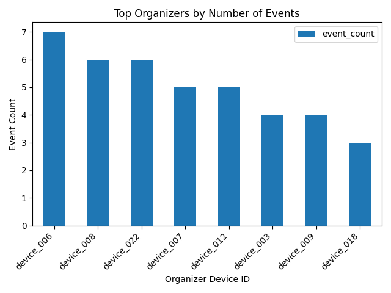
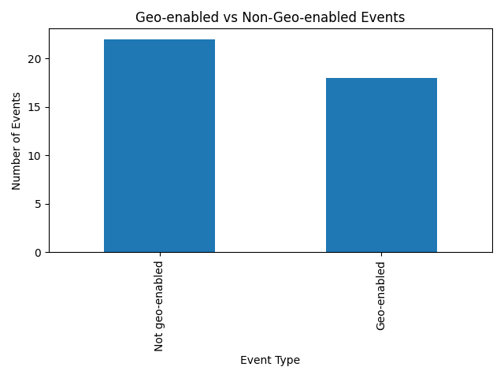
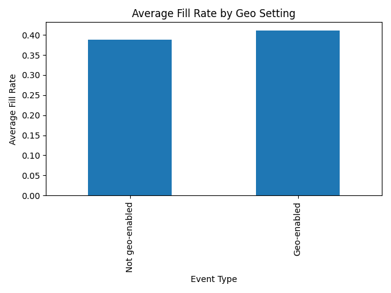
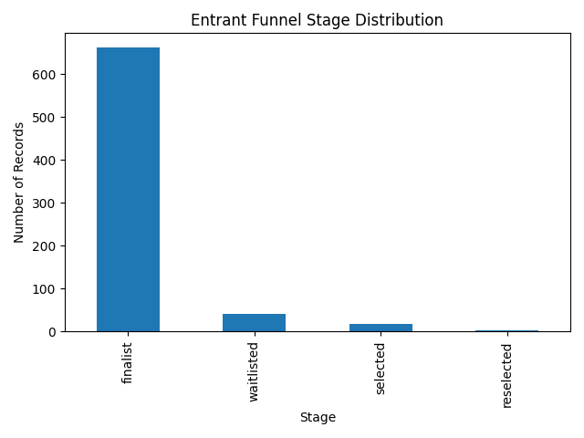

# Event Hub Analytics Layer

## Overview
This project extends **Event Hub**, an Android event management application, with a separate analytics workflow built in Python. The goal was to transform structured application data into an analytics pipeline for studying **event demand, entrant funnel progression, organizer activity, and participation trends**.

Rather than treating the app only as a software product, this extension treats it as a source of behavioral and operational data. The result is a compact analytics project showing how product data can be exported, modeled, analyzed, and communicated clearly.

---

## Analytics Questions
This analytics layer was designed around a few practical product and operations questions:

- Which organizers are driving the most platform activity?
- How does entrant activity distribute across event funnel stages?
- What share of events use geolocation features?
- Do geo-enabled events differ in fill rate from non-geo-enabled events?
- How can event capacity and participation data support planning decisions?

---

## Dataset Summary
Synthetic demo dataset generated from the Event Hub data model:

- **24 profiles**
- **8 organizers**
- **8 facilities**
- **19 entrants**
- **40 events**
- **Average event slots:** **48.02**
- **Average demand per event:** **18.1**
- **Average fill rate:** **0.398**
- **Geo-enabled event share:** **0.45**

> This dataset is synthetic and was generated from the app’s underlying structure for demonstration purposes. The focus is on analytics design, feature engineering, and insight generation.

---

## Data Pipeline
The analytics workflow is separated from the Android codebase and follows a simple pipeline:

1. **Generate synthetic platform activity** based on the Event Hub data model  
2. **Export structured event, entrant, organizer, facility, and profile data**
3. **Transform and engineer analytics features** such as:
   - demand count
   - fill rate
   - event funnel stages
   - organizer event counts
   - geo-enabled event share
4. **Analyze and visualize trends** using pandas and matplotlib

---

## Repository Structure
- `seed_demo_data.py` — generates synthetic profiles, organizers, facilities, entrants, and events
- `export_data.py` — flattens mock Firestore-style data into CSVs
- `event_analytics.py` — computes summary metrics and generates charts
- `exports/` — structured datasets and summary metrics
- `plots/` — generated visualizations

---

## Feature Engineering
To make the raw application data analysis-ready, I derived several metrics:

- **Demand count** = total entrant interest associated with an event
- **Fill rate** = proportion of event slots ultimately filled
- **Organizer activity** = number of events created per organizer
- **Entrant interaction volume** = number of event states associated with each entrant
- **Geo-enabled event share** = proportion of events using location-aware participation features

These engineered metrics made it possible to move from app records to analytics questions that are relevant for product and operations decisions.

---

## Key Findings

### 1. Organizer activity was concentrated among a subset of users
A small number of organizers accounted for a disproportionate share of total event creation.

**Analytics interpretation:**  
This resembles a common marketplace/platform pattern where a subset of power users drives a large share of activity.

**Why it matters:**  
This kind of pattern can inform organizer retention, onboarding, and support strategies.

---

### 2. Nearly half of events were geo-enabled
The platform’s event mix was relatively balanced between geo-enabled and non-geo-enabled events.

**Analytics interpretation:**  
Geolocation is not a niche feature in this dataset; it appears frequently enough to justify product-level analysis.

**Why it matters:**  
This supports future segmentation of event performance by feature usage.

---

### 3. Geo-enabled events showed a slightly higher average fill rate
Average fill rate was modestly higher for geo-enabled events than for non-geo-enabled events.

**Analytics interpretation:**  
This suggests that event format or feature configuration may influence conversion into filled slots.

**Why it matters:**  
A product team could use this kind of analysis to evaluate whether certain event configurations improve participation outcomes.

---

### 4. Entrant participation naturally formed a funnel
Entrant activity clustered into distinct stages such as **waitlisted**, **finalist**, **selected**, and **reselected**.

**Analytics interpretation:**  
The Event Hub data model supports a conversion-style funnel analysis similar to recruitment, ticketing, or marketplace workflows.

**Why it matters:**  
This creates a strong basis for future work in drop-off analysis, conversion optimization, and entrant lifecycle modeling.

---

## Business / Product Relevance
This analytics layer reframes Event Hub as more than an Android app. It demonstrates how event platform data can support:

- **capacity planning**
- **organizer performance analysis**
- **entrant funnel monitoring**
- **feature-level comparison**
- **data-informed product decisions**

---

## Skills Demonstrated
- Data extraction and transformation
- Exploratory data analysis
- Feature engineering
- Funnel analysis
- Product analytics thinking
- Data visualization
- Translating application data into business-relevant insights

---

## Limitations
Because the current dataset is synthetic, some distributions are flatter and more uniform than what would be expected in production data. For that reason, the strongest value of this project is the **analytics workflow design and feature engineering approach**, rather than the exact numerical results.

---

## Future Improvements
Natural next steps for this project would be:

- analyze real Firebase event data instead of synthetic data
- model no-show or cancellation risk
- predict oversubscribed events
- compare organizer effectiveness over time
- build a dashboard for event demand and funnel monitoring

---

## Why this matters
Event Hub began as a software engineering project, but this analytics layer shows how application data can be transformed into a structured analytics workflow. It demonstrates the ability to:

- understand and model real application data
- engineer useful metrics from operational records
- analyze participation and funnel behavior
- communicate findings through concise visualizations and interpretation

This makes the project relevant not only for software roles, but also for **data analyst** and **data science** opportunities.